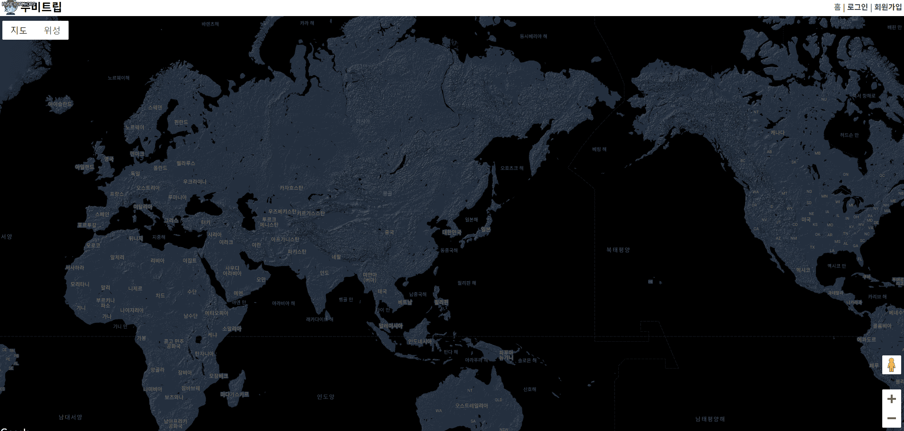
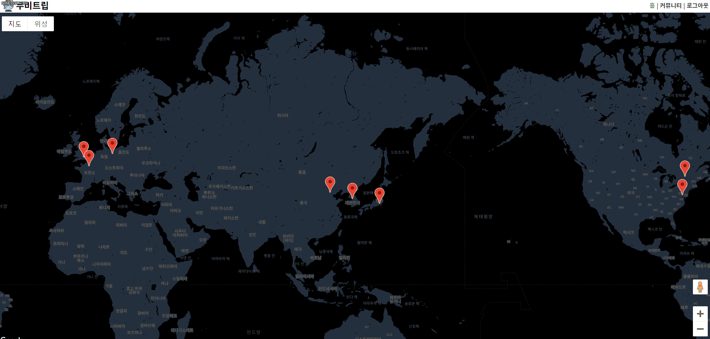
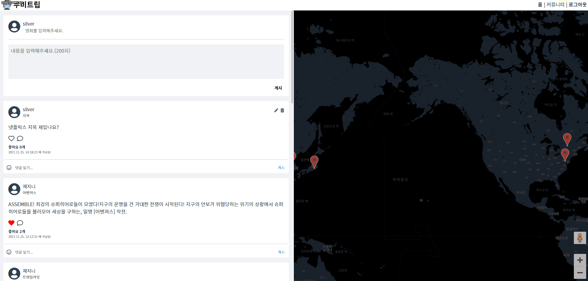
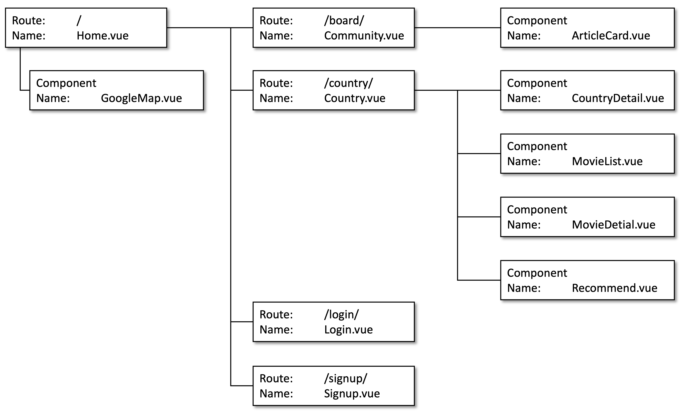
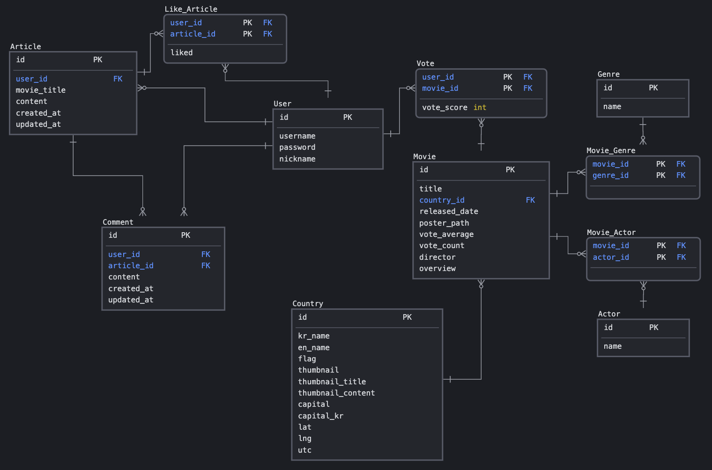

# [Movie Trip] 영화 커뮤니티 앱 🎞
**SSAFY Final Project**

[>>> 무비트립 접속하기 <<<](https://movietrip.click)

------


## 사이트 미리보기

### 1. 튜토리얼


### 2. 로그인/회원가입




### 3. 구글 지도


### 4. 국가 정보 / 평점 남기기


### 5. 영화 추천


### 6. 커뮤니티 글 작성




### 7. 커뮤니티 댓글 작성




## 개요

> 여행하는 재미, 영화보는 재미

### You can do📜
  - 여러 나라의 영화를 탐색
  - 영화 평점 등록
  - 등록한 평점을 기반으로 영화를 추천받기
  - 영화를 이야기하는 커뮤니티


## 개발도구🔨

<h3 align="left">Prototyping</h3>
<p align="left"> 
<a href="https://www.figma.com/" target="_blank" rel="noreferrer">  </a>
</p>

<h3 align="left">Frontend</h3>
<p align="left">
<a href="https://vuejs.org/" target="_blank" rel="noreferrer">  </a>
<a href="https://www.w3.org/html/" target="_blank" rel="noreferrer">  </a>
<a href="https://www.w3schools.com/css/" target="_blank" rel="noreferrer">  </a>
<a href="https://developer.mozilla.org/en-US/docs/Web/JavaScript" target="_blank" rel="noreferrer">  </a>
</p>

<h3 align="left">Backend</h3>
<p align="left">
<a href="https://www.djangoproject.com/" target="_blank" rel="noreferrer">  </a>
<a href="https://www.python.org" target="_blank" rel="noreferrer">  </a>  
</p>

<h3 align="left">Deploy</h3>
<p align="left"> 
<a href="https://aws.amazon.com" target="_blank" rel="noreferrer">  </a> 
<a href="https://www.nginx.com" target="_blank" rel="noreferrer">  </a>
</p>


<!-- for GitLab -->

## 설치🛠
### 1. Frontend

- Clone Project
```
git clone https://lab.ssafy.com/swsilver95/final-pjt-front.git
```

- Project setup
```
cd final-pjt-front
npm install
```

- run frontend server
```
npm run serve
```


### 2. Backend

- Clone Project
```
git clone https://lab.ssafy.com/swsilver95/final-pjt-back.git
```

- Project setup
```
cd final-pjt-back
pip install -r requiements.txt
```

- run backend server
```
python manage.py runserver
```


## Project Vue 구조




## ERD diagram

**Community + Movie**



## Django API 구조


<!-- end gitlab -->


## Built with

- [Google Map API](https://developers.google.com/maps) - Build awesome apps with Google’s knowledge of the real world
- [Bootstrap](https://getbootstrap.com/) - Extensive list of components and Bundled Javascript plugins.
- [openweathermap](https://openweathermap.org/) - A scientific yet simple approach to weather forecast.


## Team

- 은승원 [silver](https://github.com/swsilver95)
- 최재진 [sosin](https://github.com/svstar94)
